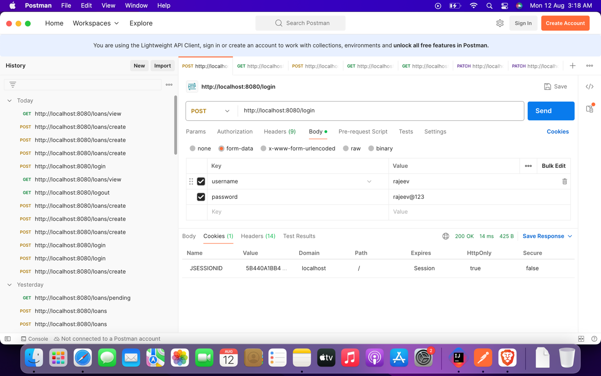

# LoanApp

## Login via Postman
http://localhost:8080/login

In body enter format data for regular users

Regular users: -

rohan => rohan@123

rajeev => rajeev @123

Admin user: -

alpha => alpha@123

## Logout via Postman

If you want to change users, click http://localhost:8080/logout

And then login again with new user

## Create loan via Postman

http://localhost:8080/loans/create

Request: -

{
"amount": 10000,
"term": 2
}

Response: -

{
"loanRequest": {
"amount": 10000,
"term": 2
},
"loan": {
"loanId": 7,
"amount": 10000,
"tenure": 2,
"loaner": "rajeev",
"status": "PENDING",
"scheduledPayments": [
{
"loanId": 7,
"paymentAmount": 5000,
"paymentDueDate": "2024-08-19",
"paymentStatus": "PENDING",
"paidOnDate": null
},
{
"loanId": 7,
"paymentAmount": 5000,
"paymentDueDate": "2024-08-26",
"paymentStatus": "PENDING",
"paidOnDate": null
}
],
"residualAmount": 0,
"paidOnDate": 0
}
}

## View loan via Postman

http://localhost:8080/loans/view

This will only show loans of the logged in user 

## View pending loans via Postman

Only admin user can view these loans

http://localhost:8080/loans/pending

If a regular user will hit this api, then nothing will be returned by the server

## Approve pending loans

http://localhost:8080/loans/approve/7

Admin can approve loans via this api

## Repay loans 

http://localhost:8080/loans/repay/1/3400

A user can repay his/her loans via this API